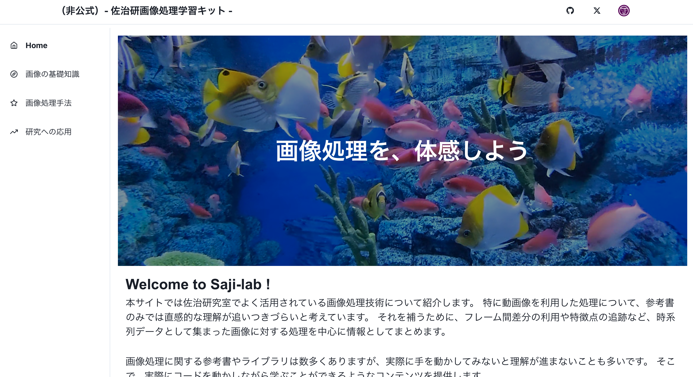

# Saji Laboratory ImageProcessing Seminar to B3 WebSite

## 📖 概要（Overview）

- 画像処理を初めて学ぶ B3 新入生向けに作成した Web ページ
- 動画像処理の学習が主な目的。時系列画像の処理が参考書ではイメージしづらいと考えたため。
- 時系列処理を施した結果を Web ページにまとめることで、学習の定着に役立てる。

## 🎥 デモ（Demo）



## ⚙️ 　学習項目（Features）

- 機能１　画像の基礎知識
- 機能２　画像処理手法
- 機能３　研究への応用

## 🛠️ 技術スタック（Tech Stack）

| 種類           | ツール／ライブラリ |
| -------------- | ------------------ |
| フロントエンド | React              |
| スタイリング   | chakraUI           |
| バージョン管理 | GitHub             |
| ビルド         | Vite               |

## 🚀 インストール／起動方法（Getting Started）

```bash
# リポジトリをクローン
git clone https://github.com/Ilekaede/saji-image-processing-web.git
cd b3semi_web

# 依存パッケージをインストール
npm install   # または yarn

# 開発サーバー起動
npm run dev   # または yarn dev
```
