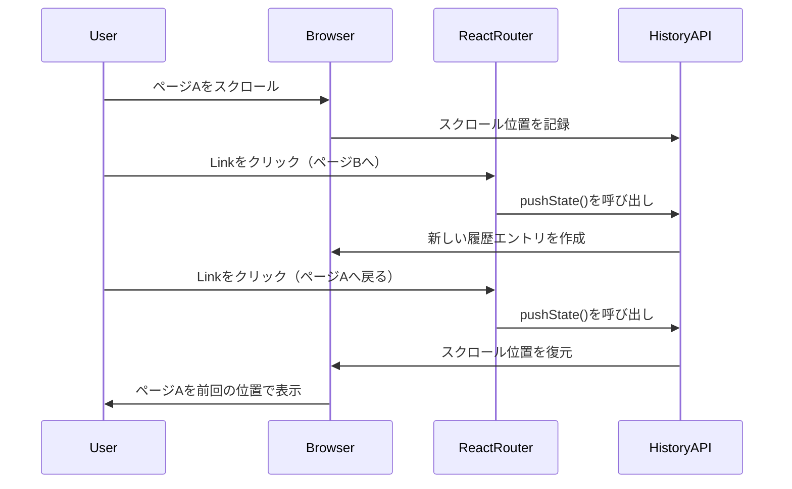

# スクロール位置の復元機能について

## 概要

このドキュメントでは、本アプリケーションにおいてページのスクロール位置が自動的に保存・復元される仕組みについて解説します。

## 技術的な仕組み

### 1. ブラウザのHistory API

モダンなブラウザは、**History API**を通じて各履歴エントリに対してスクロール位置を自動的に保存します。

#### scrollRestorationプロパティ

```javascript
// デフォルト値（自動でスクロール位置を管理）
window.history.scrollRestoration = 'auto';

// 手動でスクロール位置を管理
window.history.scrollRestoration = 'manual';
```

#### 動作の流れ

1. ユーザーがページをスクロール
2. ブラウザが現在の履歴エントリにスクロール位置を記録
3. ユーザーが別のページに移動（新しい履歴エントリが作成される）
4. ユーザーが戻るボタンや履歴ナビゲーションで前のページに戻る
5. ブラウザが保存されたスクロール位置を復元

### 2. React Router v6の動作

React Router v6は、SPAのナビゲーションにおいてブラウザのHistory APIを活用しています。

#### 現在の実装

```tsx
// App.tsx
import { BrowserRouter as Router, Route, Routes } from "react-router-dom";

const App = () => {
  return (
    <Router basename={process.env.PUBLIC_URL}>
      <Routes>
        <Route path="/" element={<Home />} />
        <Route path="/Manual" element={<Manual />} />
        <Route path="/Methods" element={<Methods />} />
        {/* ... */}
      </Routes>
    </Router>
  );
};
```

#### Linkコンポーネントの動作

```tsx
// Sidebar.tsx
import { Link } from "react-router-dom";

<Link to={url || "#"}>
  {/* ... */}
</Link>
```

`Link`コンポーネントをクリックすると：
1. `history.pushState()`が呼び出される
2. ブラウザが現在のスクロール位置を履歴エントリに保存
3. 新しいページがレンダリングされる
4. ユーザーが戻ってくると、保存されたスクロール位置が復元される

### 3. シーケンス図



## なぜこの動作が発生するのか

### 設計思想

1. **ブラウザのデフォルト動作**
   - モダンブラウザは、ユーザー体験向上のため、履歴ナビゲーション時にスクロール位置を自動復元
   - これは従来のマルチページWebサイトと同じ動作

2. **React Routerの設計思想**
   - React Router v6は、可能な限りブラウザのネイティブな動作を尊重
   - 特別な設定をしない限り、ブラウザのデフォルト動作を活用

3. **ユーザー体験の向上**
   - ユーザーが前のページに戻った際、読んでいた位置から再開できる
   - ネイティブアプリのような自然なナビゲーション体験

## スクロール動作のカスタマイズ

必要に応じて、スクロール動作をカスタマイズできます。

### 方法1: ScrollRestorationコンポーネント（推奨）

React Router v6.4以降では、`ScrollRestoration`コンポーネントが提供されています。

```tsx
import { ScrollRestoration } from 'react-router-dom';

function App() {
  return (
    <Router>
      <ScrollRestoration />
      {/* Routes */}
    </Router>
  );
}
```

### 方法2: カスタムフックで常にトップにスクロール

```tsx
import { useEffect } from 'react';
import { useLocation } from 'react-router-dom';

function ScrollToTop() {
  const { pathname } = useLocation();

  useEffect(() => {
    window.scrollTo(0, 0);
  }, [pathname]);

  return null;
}

// App.tsxで使用
function App() {
  return (
    <Router>
      <ScrollToTop />
      {/* Routes */}
    </Router>
  );
}
```

### 方法3: 手動でscrollRestorationを設定

```tsx
import { useEffect } from 'react';

function App() {
  useEffect(() => {
    if ('scrollRestoration' in window.history) {
      window.history.scrollRestoration = 'manual';
    }
  }, []);

  return (
    <Router>
      {/* Routes */}
    </Router>
  );
}
```

## 現在の実装の評価

### メリット

- **実装がシンプル**: 特別なコードが不要
- **ユーザーフレンドリー**: 読んでいた位置から再開できる
- **ブラウザネイティブ**: パフォーマンスが良い

### デメリット

- **予期しない動作**: ユーザーが常にページトップから見たい場合には不適切
- **コンテンツの変更**: ページ内容が動的に変わる場合、スクロール位置が不適切になる可能性

## 推奨事項

現在の動作（スクロール位置の自動復元）は、多くのユースケースでユーザー体験を向上させます。特に：

- 長いコンテンツページ
- リスト形式のページ
- ドキュメントサイト

ただし、以下の場合はカスタマイズを検討してください：

- ページ遷移時に常にトップから見せたい
- ページ内容が頻繁に変わる
- 特定のセクションにスクロールさせたい

## 参考リンク

- [React Router - ScrollRestoration](https://reactrouter.com/en/main/components/scroll-restoration)
- [MDN - History API](https://developer.mozilla.org/en-US/docs/Web/API/History_API)
- [MDN - scrollRestoration](https://developer.mozilla.org/en-US/docs/Web/API/History/scrollRestoration)
- [Web.dev - History API](https://web.dev/history-api/)

## 関連Issue

- [Issue #23: ページの最終閲覧位置について](https://github.com/Ilekaede/saji-image-processing-web/issues/23)

---

## 実装内容（2025-11-28）

### 変更内容

ユーザーの要望により、ページ遷移時に**常にトップから表示される**ように変更しました。

### 実装方法

**方法2: カスタムフックで常にトップにスクロール**を採用しました。

#### 新規ファイル

[src/components/layout/ScrollToTop.tsx](file:///Users/a_sakura/work-space/b3semi_web/src/components/layout/ScrollToTop.tsx)

```tsx
import { useEffect } from 'react';
import { useLocation } from 'react-router-dom';

/**
 * ページ遷移時に常にトップにスクロールするコンポーネント
 */
const ScrollToTop = () => {
  const { pathname } = useLocation();

  useEffect(() => {
    window.scrollTo(0, 0);
  }, [pathname]);

  return null;
};

export default ScrollToTop;
```

#### 変更ファイル

[src/App.tsx](file:///Users/a_sakura/work-space/b3semi_web/src/App.tsx)

```tsx
import ScrollToTop from "./components/layout/ScrollToTop";

const App = () => {
  return (
    <Router basename={process.env.PUBLIC_URL}>
      <ScrollToTop />  {/* 追加 */}
      <Box minH="100vh" bg="slate.50">
        {/* ... */}
      </Box>
    </Router>
  );
};
```

### 動作確認

ブラウザテストで以下を確認：
- ページ遷移時に常にトップから表示される
- 以前のスクロール位置は復元されない

### ブランチ

`feature/23-scroll-to-top`

---

## 更新履歴

| 日付 | 変更内容 |
|------|----------|
| 2025-11-28 | 初版作成（調査結果） |
| 2025-11-28 | ScrollToTopコンポーネントを実装 |
